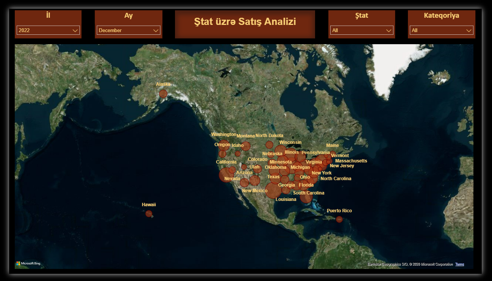
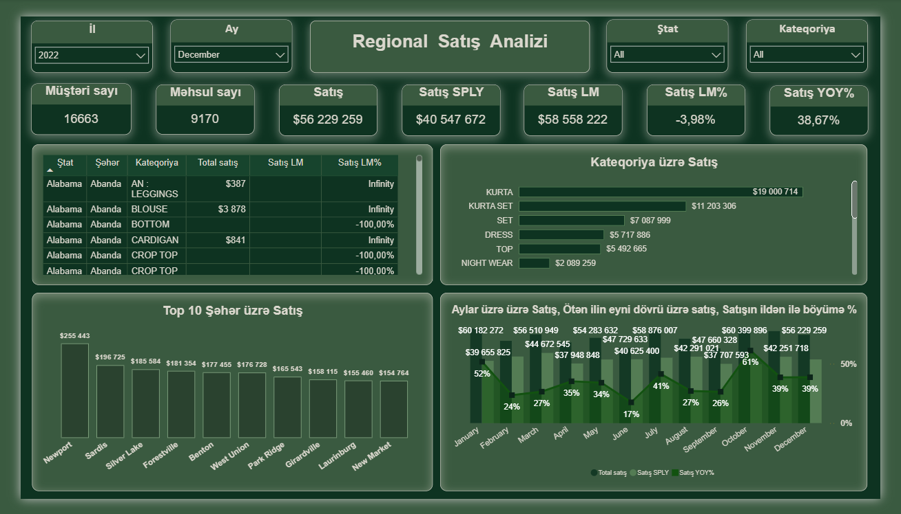
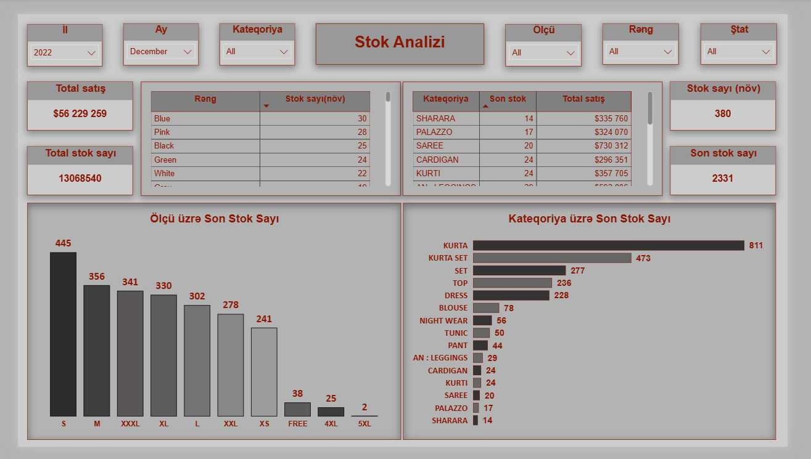
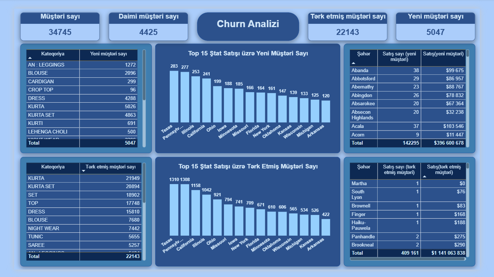

# 📊 Amazon Sales Analytics Dashboard


## 📌 Project Overview
This project is an interactive Sales Analytics Dashboard built in Power BI to analyze sales performance, customer churn, and inventory for an Amazon-style e-commerce dataset. It combines multiple related data tables (sales, stock, SKU, and city data) into a single data model, providing a 360° view of business performance to support data-driven decisions.
---
## 📸 Dashboard Preview
### state_sales_map

### regional_sales_analysis

### stock_analysis

### churn_analysis

---
## 🎯 Project Objectives
- Visualize sales distribution across U.S. states on an interactive map
- Monitor regional sales performance and key business KPIs
- Track inventory and stock levels across categories, sizes, and colors
- Analyze customer churn and retention patterns
---
## 📄 Dashboard Pages
### State-wise Sales Map
**Visualizations**
- Geographic distribution of sales across U.S. states (bubble map)
- Filterable by Year, Month, State, and Category
---
### Regional Sales Analysis
**KPIs**
- Total Customers
- Total Products
- Sales
- Sales (Same Period Last Year)
- Sales (Last Month)
- Last Month Growth %
- Year-over-Year Growth %
**Visualizations**
- Sales by State, City, and Category
- Sales by Category
- Top 10 Cities by Sales
- Monthly Sales Trend vs. Prior Year with YoY Growth %
---
### Stock Analysis
**KPIs**
- Total Sales
- Total Stock Count
- Stock Count (Variant)
- Latest Stock Count
**Visualizations**
- Stock Count by Color
- Latest Stock by Category
- Latest Stock by Size
- Latest Stock by Category (breakdown)
---
### Churn Analysis
**KPIs**
- Total Customers
- Repeat Customers
- Churned Customers
- New Customers
**Visualizations**
- New Customers by Category
- Churned Customers by Category
- Top 15 States by New Customer Sales
- Top 15 States by Churned Customer Sales
- Sales by City (New vs. Churned Customers)
---
## 🛠 Tools & Technologies
- Power BI
- Power Query (data transformation and cleaning)
- Data Modeling (relationships across Sales, Stock, SKU, and City tables)
- DAX (calculated measures & KPIs)
- Data Visualization
---
## 🔗 Data Model
The project connects and relates four core tables into a single data model:
- **City** — geographic reference data
- **Sales** — transactional sales data
- **Stock** — inventory and stock levels
- **SKU** — product/category details
Relationships between these tables enable cross-filtering across all four dashboard pages.
---
## 📂 Dataset
Amazon-style e-commerce sales dataset (aggregated, no personally identifiable information).
---
## 📁 Repository Structure
```text
amazon-sales-analysis
│
├── amazon_sales_analysis.pbix
├── README.md
└── images
    ├── state_sales_map.png
    ├── regional_sales_analysis.png
    ├── stock_analysis.png
    └── churn_analysis.png
```
---
## ⭐ Key Features
- Interactive dashboards with dynamic slicers (Year, Month, Category, Size, Color, State)
- Multi-table data model with defined relationships
- Geographic sales mapping across U.S. states
- Regional sales performance tracking
- Inventory and stock-level monitoring
- Customer churn and retention analysis
- Month-over-month and year-over-year growth comparisons
- Clean and user-friendly dashboard design
---
## 🤝 Connect
If you have any feedback or suggestions, feel free to connect with me on [LinkedIn](https://www.linkedin.com/in/aydamirova).
---
**Author:** Sevil Aydamirova
Data Analyst | Excel | Power BI | SQL | Python |
